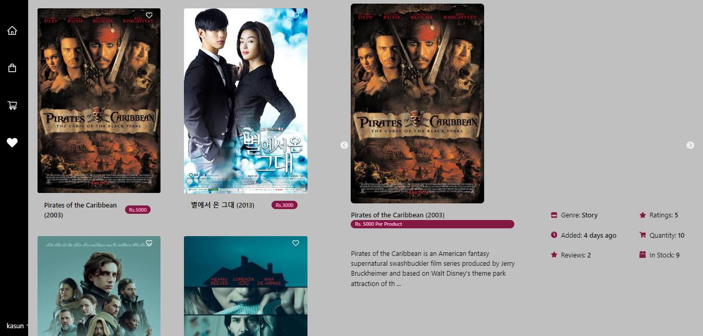
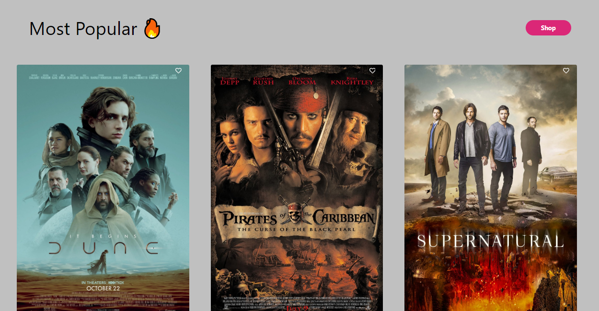
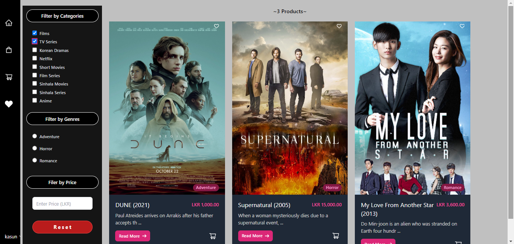
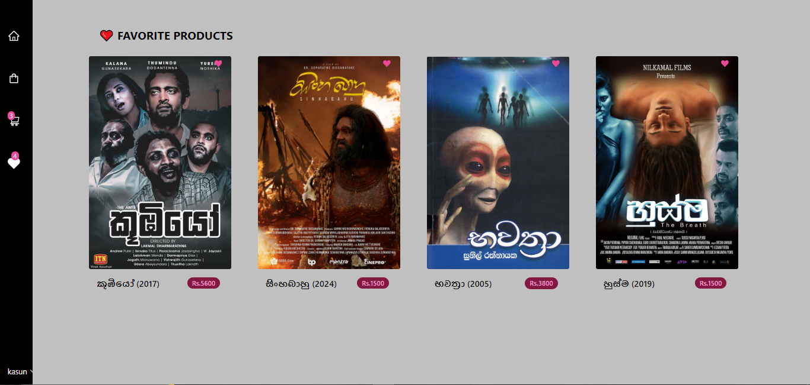
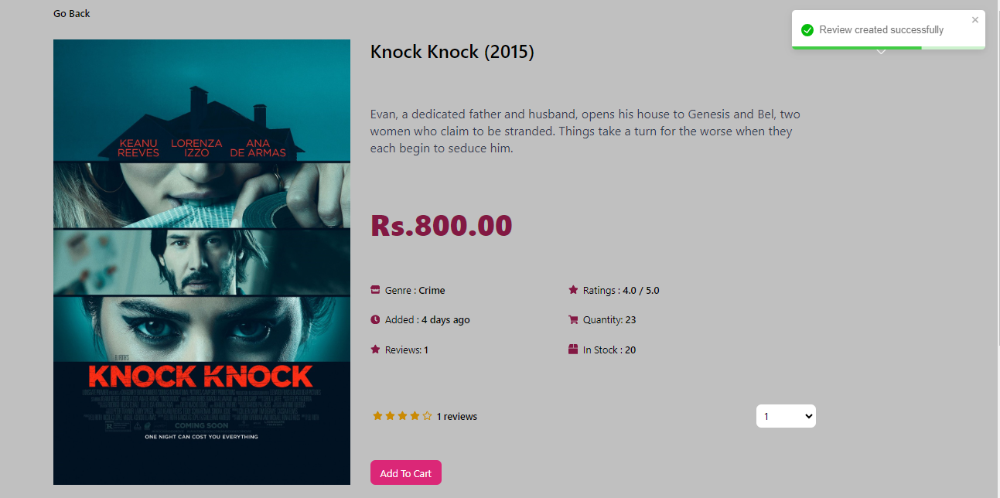
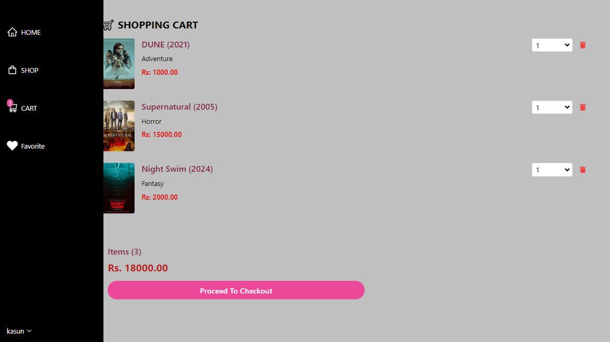

# Module Installed

### BACKEND(in project location)

npm i nodemon multer mongoose jsonwebtoken express-formidable express-async-handler express dotenv cors
 cookie-parser concurrently bcryptjs

### FRONTEND(in frontend folder)

npm i slick-carousel react-slick react-toastify react-router react-router-dom react-redux react-icons
 apexcharts react-apexcharts moment flowbite axios @reduxjs/toolkit @paypal/react-paypal-js

# View

### Register Page

### Home

### Trending

### Shop

### Favourite

### Product

### Cart

